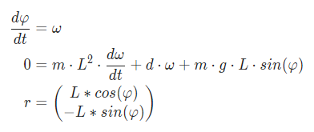

# Modia.jl

[](https://modiasim.github.io/Modia.jl/stable)
[](https://github.com/ModiaSim/Modia.jl/blob/master/LICENSE)

The [Modia Tutorial](https://modiasim.github.io/Modia.jl/stable/tutorial/GettingStarted.html) provides an introduction to Modia.
The [Modia3D Tutorial](https://modiasim.github.io/Modia3D.jl/stable/tutorial/GettingStarted.html) provides an introduction to use 3D components in Modia. Modia is part of [ModiaSim](https://modiasim.github.io/docs/).
 
[Modia](https://github.com/ModiaSim/Modia.jl) is an environment in form of a Julia package to model and simulate physical systems (electrical, mechanical, thermo-dynamical, etc.) described by differential and algebraic equations. A user defines a model on a high level with model components (like a mechanical body, an electrical resistance, or a pipe) that are physically connected together. A model component is constructed by **`expression = expression` equations** or by Julia structs/functions, such as the pre-defined [Modia3D](https://github.com/ModiaSim/Modia3D.jl) multibody components. The defined model is symbolically processed (for example, equations might be analytically differentiated) with algorithms from package [ModiaBase.jl](https://github.com/ModiaSim/ModiaBase.jl). From the transformed model a Julia function is generated that is used to simulate the model with integrators from [DifferentialEquations.jl](https://github.com/SciML/DifferentialEquations.jl).

The basic type of the floating point variables is usually *Float64*, but can be set to any type *FloatType <: AbstractFloat* via
*@instantiateModel(..., FloatType = xxx)*, for example it can be set to *Float32, DoubleFloat, Measurement{Float64}, StaticParticles{Float64,100}*.

After a simulation, an instantiated model is treated as a *signal table* and therefore all functions from package [SignalTables.jl](https://github.com/ModiaSim/SignalTables.jl) can be used on it. In particular, the simulation results together with all parameter and start values can be stored on file in *JSON* or in *HDF5* format.

## Installation

The package is registered and is installed with (Julia >= 1.7 is required):

```julia
julia> ]add Modia
```

Furthermore, one or more of the following packages should be installed in order
to be able to generate plots:

```julia
julia> ]add SignalTablesInterface_PyPlot        # if plotting with PyPlot desired
        add SignalTablesInterface_GLMakie       # if plotting with GLMakie desired
        add SignalTablesInterface_WGLMakie      # if plotting with WGLMakie desired
        add SignalTablesInterface_CairoMakie    # if plotting with CairoMakie desired
        
        # might be sometimes also useful
        add SignalTables
```

or call `t = getValues(instantiatedModel, "time"), y = getValues(instantiatedModel, "y")` to retrieve
the results in form of vectors and arrays and use any desired plot package for plotting, e.g., `plot(t,y)`.

Note, Modia reexports the following definitions 

- `using Unitful`
- `using DifferentialEquations`
- `using SignalTables`
- and exports functions `CVODE_BDF` and `IDA` of [Sundials.jl](https://github.com/SciML/Sundials.jl).

As a result, it is usually sufficient to have `using Modia` in a model to utilize the relevant 
functionalities of these packages.


## Examples

The following equations describe a damped pendulum:




where *phi* is the rotation angle, *omega* the angular velocity, *m* the mass, *L* the rod length, *d* a damping constant, *g* the gravity constant and *r* the vector from the origin of the world system to the tip of the pendulum. These equations can be defined, simulated and plotted with
(note, you can define models also without units, or remove units before the model is processed):

```julia
using Modia

Pendulum = Model(
   L = 0.8u"m",
   m = 1.0u"kg",
   d = 0.5u"N*m*s/rad",
   g = 9.81u"m/s^2",
   phi = Var(init = 1.57*u"rad"),
   w   = Var(init = 0u"rad/s"),
   equations = :[
          w = der(phi)
        0.0 = m*L^2*der(w) + d*w + m*g*L*sin(phi)
          r = [L*cos(phi), -L*sin(phi)]
   ]
)

pendulum1 = @instantiateModel(Pendulum)
simulate!(pendulum1, Tsit5(), stopTime = 10.0u"s", log=true)

showInfo(pendulum1)  # print info about the result
writeSignalTable("pendulum1.json", pendulum1, indent=2, log=true)

@usingModiaPlot   # Use plot package defined with
                  # ENV["SignalTablesPlotPackage"] = "XXX" or with 
                  # usePlotPackage("XXX")
plot(pendulum1, [("phi", "w"); "r"], figure = 1)
```
The result is the following print output

```julia
name     unit           size    eltypeOrType kind attributes
─────────────────────────────────────────────────────────────────────────────────────────────────────
time     "s"            (501,)  Float64      Var  independent=true
w        "rad*s^-1"     (501,)  Float64      Var  start=0 rad s^-1, fixed=true, state=true, der="der…
der(w)   "rad*s^-2"     (501,)  Float64      Var
phi      "rad"          (501,)  Float64      Var  start=1.57 rad, fixed=true, state=true, der="der(p…
der(phi) "rad*s^-1"     (501,)  Float64      Var
r        "m"            (501,2) Float64      Var
L        "m"            ()      Float64      Par
m        "kg"           ()      Float64      Par
d        "m*N*s*rad^-1" ()      Float64      Par
g        "m*s^-2"       ()      Float64      Par
```
file [pendulum1.json](https://modiasim.github.io/Modia.jl/resources/fileio/pendulum1.json) and the following plot:


Simulation and plotting of the pendulum with normally distributed uncertainty added to some parameters is performed in the following way:

```julia
using Measurements

PendulumWithUncertainties = Pendulum | Map(L = (0.8 ± 0.2)u"m",
                                           m = (1.0 ± 0.2)u"kg",
                                           d = (0.5 ± 0.2)u"N*m*s/rad")

pendulum2 =  @instantiateModel(PendulumWithUncertainties,
                               FloatType = Measurement{Float64})

simulate!(pendulum2, Tsit5(), stopTime = 10.0u"s")
plot(pendulum2, [("phi", "w"); "r"], figure = 2)
```

resulting in the following plot where mean values are shown with thick lines
and standard deviations as area around the mean values.


## Main Developers

- [Hilding Elmqvist](mailto:Hilding.Elmqvist@Mogram.net), [Mogram](http://www.mogram.net/).
- [Martin Otter](https://rmc.dlr.de/sr/en/staff/martin.otter/),
  [DLR - Institute of System Dynamics and Control](https://www.dlr.de/sr/en).

