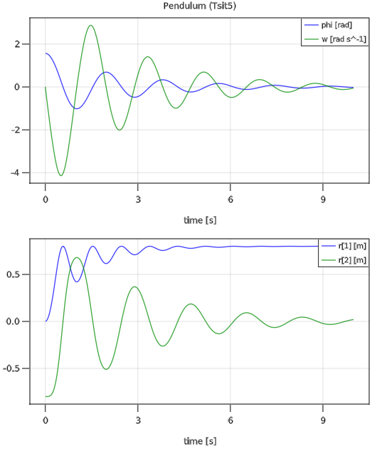
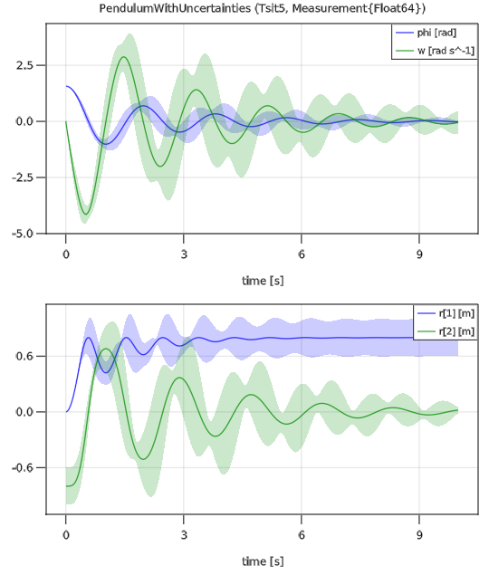

# Modia.jl

[](https://modiasim.github.io/Modia.jl/stable)
[](https://github.com/ModiaSim/Modia.jl/blob/master/LICENSE)

The [Modia Tutorial](https://modiasim.github.io/Modia.jl/tutorial/GettingStarted.html) provides an introduction to Modia. Modia is part of [ModiaSim](https://modiasim.github.io/docs/).

Modia is a Julia package for modeling and simulation of multidomain engineering systems
described by differential equations, algebraic equations, and (space-discretized) partial differential equations. It shares many powerful features of the [Modelica language](https://www.modelica.org/modelicalanguage), together with features not available in Modelica. 

A user defines a model on a high level with model components (like an electrical resistance, a rotational inertia, a rod with heat transfer, a PI controller etc.) that are physically connected together. A model component is constructed by "expression = expression" equations. The defined model is symbolically transformed to ODE form dx/dt = f(x,t). For example, equations might be analytically differentiated, ODE states selected, linear equation systems numerically solved when evaluating the transformed model. From the transformed model a Julia function is generated that is used to simulate the model with integrators from [DifferentialEquations](https://github.com/SciML/DifferentialEquations.jl). Simulation results can be plotted with [ModiaPlot](https://github.com/ModiaSim/ModiaPlot.jl), that provides a convenient interface to [GLMakie](https://github.com/JuliaPlots/GLMakie.jl) line plots.

Other packages from the Julia eco-systems that are specially supported:

- [Unitful](https://github.com/PainterQubits/Unitful.jl) to define and process physical units.
- [Measurements](https://github.com/JuliaPhysics/Measurements.jl) to perform simulations with uncertain parameters and initial values with linear propagation theory.
- [MonteCarloMeasurements](https://github.com/baggepinnen/MonteCarloMeasurements.jl) to perform simulations with uncertain parameters and initial values with particle theory.


## Installation

Modia and ModiaPlot are registered and are installed with (Julia >= 1.5 is required):

```julia
julia> ]add Modia, ModiaPlot
```

It is recommended to also add the following packages, in order that all tests and examples can be executed in your standard environment:

```julia
julia> ]add Measurements 
        add MonteCarloMeasurements
        add Distributions
        add Interpolations
```

## Examples

The following equations describe a damped pendulum:


where *phi* is the rotation angle, *omega* the angular velocity, *m* the mass, *L* the rod length, *d* a damping constant, *g* the gravity constant and *r* the vector from the origin of the world system to the tip of the pendulum. These equations can be defined, simulated and plotted with
(note, you can define models also without units, or remove units before the model is processed):

```julia
using Modia, ModiaPlot

Pendulum = Model(
   L = 0.8u"m",
   m = 1.0u"kg",
   d = 0.5u"N*m*s/rad",
   g = 9.81u"m/s^2",
   phi = Var(init = 1.57*u"rad"),
   w   = Var(init = 0u"rad/s"),
   equations = :[
          w = der(phi)
        0.0 = m*L^2*der(w) + d*w + m*g*L*sin(phi)
          r = [L*cos(phi), -L*sin(phi)]
   ]
)

pendulum1 = @instantiateModel(Pendulum)
simulate!(pendulum1, Tsit5(), stopTime = 10.0u"s", log=true)
plot(pendulum1, [("phi", "w"); "r"], figure = 1)
```

The result is the following plot:



Simulation and plotting of the pendulum with normally distributed uncertainty added to some parameters is performed in the following way:

```julia
using Measurements

PendulumWithUncertainties = Pendulum | Map(L = (0.8 ± 0.2)u"m",
                                           m = (1.0 ± 0.2)u"kg",
                                           d = (0.5 ± 0.2)u"N*m*s/rad")

pendulum2 =  @instantiateModel(PendulumWithUncertainties,
                               FloatType = Measurement{Float64})

simulate!(pendulum2, Tsit5(), stopTime = 10.0u"s")
plot(pendulum2, [("phi", "w"); "r"], figure = 2)
```

resulting in the following plot where mean values are shown with thick lines
and standard deviations as area around the mean values.




## Main Developers

- [Hilding Elmqvist](mailto:Hilding.Elmqvist@Mogram.net), [Mogram](http://www.mogram.net/).

- [Martin Otter](https://rmc.dlr.de/sr/en/staff/martin.otter/),
  [DLR - Institute of System Dynamics and Control](https://www.dlr.de/sr/en).

License: MIT (expat)


