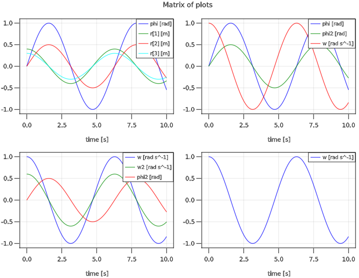

# Functions

```@meta
CurrentModule = Modia
```


## Instantiation

```@docs
@instantiateModel
instantiateModel
```

## Simulation

```@docs
simulate!
```


## Linearization

```@docs
linearize!
```

## Parameters/Init/Start

```@meta
CurrentModule = Modia
```

The following functions are provided to inquire values of *parameters* and of
*init/start* values before and after *evaluation*:

| Functions                         | Description                                             |
|:----------------------------------|:--------------------------------------------------------|
| [`hasParameter`](@ref)            | Return true, if a parameter/init/start name is known    |
| [`getParameter`](@ref)            | Return value of a parameter/init/start name             |
| [`getEvaluatedParameter`](@ref)   | Return value of an evaluated parameter/init/start name  |
| [`getLastValue`](@ref)            | Return last available value of a variable name          |
| [`showParameters`](@ref)          | Print the parameters and the init/start values          |
| [`showEvaluatedParameters`](@ref) | Print the evaluated parameters and init/start values    |


```@docs
hasParameter
getParameter
getEvaluatedParameter
getLastValue
showParameters
showEvaluatedParameters
```


## Results and Plotting

```@meta
CurrentModule = Modia
```

The simulation result of a model `instantiatedModel` are provided as a *signal table*,
see [SignalTables.jl](https://github.com/ModiaSim/SignalTables.jl).

Therefore, all [signal table functions](https://modiasim.github.io/SignalTables.jl/stable/Functions/OverviewOfFunctions.html)
can be used on a simulated model

To activate the defined plot package, use

- [`@usingModiaPlot`](@ref)

Alternatively, `usingPlotPackage` (from Modia reexported macro of SignalTables) can be used,
but then package `SignalTables` must be in your current environment.

Example:

```
using Modia

FirstOrder = Model(
    T = 0.2u"s",
    x = Var(init=0.3),
    equations = :[u = sin(time/u"s")
                  T * der(x) + x = u
                  y = 2*x]
)
simulate!(firstOrder, stopTime=10)
showInfo(firstOrder)    # list info about the result
t = getValues(firstOrder, "time")
y = getValues(firstOrder, "y")      # use any plot program: plot(t,y)

# Write result on file
writeSignalTable("firstOrder.json", firstOrder, indent=2, log=true)
```

See the generated [json-file](../resources/fileio/firstOrder.json).

For plotting, a plot package must be installed, e.g.,

```julia
julia> ]add SignalTablesInterface_PyPlot        # if plotting with PyPlot desired
        add SignalTablesInterface_GLMakie       # if plotting with GLMakie desired
        add SignalTablesInterface_WGLMakie      # if plotting with WGLMakie desired
        add SignalTablesInterface_CairoMakie    # if plotting with CairoMakie desired
```

In a model, the desired plot package is defined with:

```julia
using Modia
usePlotPackage("PyPlot")    # or ENV["SignalTablesPlotPackage"] = "PyPlot"
```

A Modia variable `a.b.c` is identified by a String key `"a.b.c"`.
The legends/labels of the plots are automatically constructed by the
names and units of the variables. Example:

```julia
using Modia
@usingModiaPlot   # execute `using SignalTablesInterface_XXX` or
                  # execute `using Modia.SignalTables.SilentNoPlot`

instantiatedModel = @instantiateModel(...)
simulate!(instantiatedModel, ...)
plot(instantiatedModel,
     [ ("phi", "r")        ("phi", "phi2", "w");
       ("w", "w2", "phi2") "w"                ],
     heading="Matrix of plots")
```

generates the following plot:




```@meta
CurrentModule = Modia
```

```@docs
@usingModiaPlot
```

## PathPlanning

```@meta
CurrentModule = Modia
```

There are some pre-defined functions to define reference paths

```@docs
PTP_path
pathEndTime
getPosition!
getPosition
getIndex
getPath
```