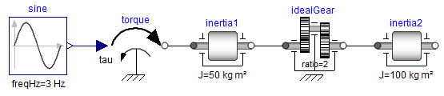

# TinyModia Tutorial

# 1 Introduction

This tutorial gives an overview of package [TinyModia](https://github.com/ModiaSim/TinyModia.jl)
to construct component-based and equation-based models with the **TinyModia language**
on a high level, symbolically transforming these models into ODEs
(Ordinary Differential Equations in state space form), simulating them and plotting result variables.

# 2 Modeling

## 2.1 Equation oriented models

A simple differential equation with $x(t) \in \R$

```math
T \cdot \frac{dx}{dt} + x = 2; \;\;\; x(t_0) = 0.5
```

can be defined with a constructor `Model` taking a comma separated
list of name/value pairs:


```julia
    using TinyModia

    SimpleModel = Model(
        T = 0.2,
        x = Var(init=0.5),
        equation = :[T * der(x) + x = 2],
    )
```
The model consist of a definition of a parameter `T` with default value 0.2, constructor `Var` with an `init` key is used to define the initial condition 0.5 of the state `x`, and one equation. Equations can have a Julia expression on both sides of the equal sign and are given as a *quoted* array expression `:[ ]` assigned to a unique identifier such as `equation`. The equation will be symbolically solved for the derivative `der(x)` before simulation, so the following equation will be used for the integration:

```math
\frac{dx}{dt} = (2 - x) / T
```

A low pass filter block with input `u` and output `y`

```math
\begin{aligned}
T \cdot \frac{dx}{dt} + x &= u\\
     y &= x \\
x(t_0) &= 0
\end{aligned}
```
can be defined as:

```julia
    using ModiaBase

    LowPassFilter = Model(
        T = 0.2,
        u = input,
        y = output | Var(:x),
        x = Var(init=0),
        equation = :[T * der(x) + x = u],
    )
```
The symbols `input` and `output` refer to predefined variable constructors to define the input and output variables. If an equation has just a unique variable in the left hand side, `y`, the right hand side can be given as a quoted expression in a Var-constructor `Var(:x)` after the `output` constructor combined with the merge operator, `|`, see below.

## 2.2 Merging models

It is possible to combine models by merging. If we want to change the model to become a highpass filter, an alternative output equation

```math
y = -x + u
```

is defined in an anonymous model `Model( y = :(-x + u) )`. This anonymous model is merged with `LowPassFilter` using the merge operator `|`:

```julia
HighPassFilter = LowPassFilter | Model( y = :(-x + u) )
```

The merging implies that the `output` property of `y` is kept, but the binding expression is changed from `:x` to `:(-x + u)`.

In general, recursive merging is desired and TinyModia provides a `mergeModels` function for that (see appendix [A.3 MergeModels algorithm](@ref)). This function is invoked as a binary operator `|` (also used for merge in Python). Note, that the order of the arguments/operands are important.

Generalizing the block to have two outputs for both low and high pass filtering would be done as follows:

```julia
LowAndHighPassFilter = LowPassFilter | Model(
        y = nothing,
        low = output | Var(:x),
        high = output | Var(:(-x + u)),
    )
```
The equation for `y` is removed by "assigning" `nothing` and two variables are defined and declared as outputs.

Model `LowAndHighPassFilter` represents the following equations:

```math
\begin{aligned}
T \cdot \frac{dx}{dt} + x &= u\\
     low &= x \\
    high &= -x + u \\
x(t_0) &= 0
\end{aligned}
```

By turning on logging of merging `setLogMerge(true)`, the translator gives the log:

```julia
Adding: value = :(x)
Adding: value = :(-x + u)
Deleting: y
Adding: low = Var(
      output = true,
      value = :(x),
    ),
Adding: high = Var(
      output = true,
      value = :(-x + u),
    ),
```

The resulting model is pretty printed by calling `@showModel(LowAndHighPassFilter)`:

```julia
LowAndHighPassFilter = Model(
  T = 0.2,
  u = Var(
    input = true,
  ),
  x = Var(
    init = 0.0 V,
  ),
  equations = :([T * der(x) + x = u]),
  low = Var(
    output = true,
    value = :(x),
  ),
  high = Var(
    output = true,
    value = :(-x + u),
  ),
),
```

## 2.3 Functions and tables

In order to test an input/output block as defined in the previous section, an input needs to be defined. This can be made by adding an equation for `u`. Assume we want `u` to be sinousoidial with an increasing frequency:

```julia
using Unitful

TestLowAndHighPassFilter = LowAndHighPassFilter | Model(
        u = :(sin( (time+1u"s")*u"1/s/s" * time)*u"V"),
        x = Var(init=0.2u"V")
    )
```

`time` is a reserved name for the independent variable. It has unit `s` for seconds. The Julia package [Unitful](https://painterqubits.github.io/Unitful.jl/stable/) provides a means for defining units and managing unit inference. Definition of units is done with a string macro `u"..."`. In this case, the input signal was given unit Volt. The state x must then also have consistent unit, that is Volt. If the model equations contain systems of simultaneous equations, then approximate guess values, optionally with units, must be given `start`: `i = Var(start=0.0u"A")`.

The input signal can also be defined by interpolation in a table:

```julia
using Interpolations

table = CubicSplineInterpolation(0:0.5:2.0, [0.0, 0.7, 2.0, 1.8, 1.2])
TestLowAndHighPassFilter2 = TestLowAndHighPassFilter | Map(u = :(table(time*u"1/s"))*u"V"
```

A function cannot return more as one variable and a function cannot modify
one of its arguments:

```
equations = :[
    (y1, y1) = fc1(u1,u2)      # Error: Two return arguments
    fc2!(u,y)                  # Error: Not known that fc2! computes y
    println("This is a test")  # Fine
]
```

The first issue can be fixed by rewriting the function call:

```
equations = :[
    v  = fc1(u1,u2)
    y1 = v[1]
    y2 = v[2]
]
```


## 2.4 Hierarchical modeling

Sofar, the composition of models have resulted in named tuples with values being numeric values or quoted expressions. Hierarchical models are obtained if the values themself are named tuples. A model with two filters can, for example, be defined as follows:

```julia
TwoFilters = (
    high = HighPassFilter,
    low = LowPassFilter,
)
```

Note, that the previous definitions of HighPassFilter and LowPassFilter was used instead of making the defintions inline.

A band pass filter is a series connection of a high pass filter and a low pass filter and can be described as:

```julia
BandPassFilter = (
    u = input,
    y = output,
    high = HighPassFilter | Map(T=0.5, x=Var(init=0.1u"V")),
    low = LowPassFilter | Map(x=Var(init=0.2u"V")),
    equations = :[
        high.u = u,
        low.u = high.y,
        y = low.y]
)
```

A new input have been defined which is propagated to `high.u`. The series connection itself is obtained by the equation `low.u = high.y`. Note, that dot-notation is allowed in equations.

The input and output for the BandPassFilter when using the same input definition as for the TestLowPassFilter is shown below:


The above examples are available in file `SimpleFilters.jl`.

## 2.5 Physically oriented modeling

Sofar, only signal flow modeling has been used, i.e. input/output blocks coupled with equations between outputs and inputs. For object oriented modeling more high level constructs are neccessary. Coupling is then acausal and involves potentials such as electric potential, positions, pressure, etc. and flows such as electric current, forces and torques and mass flow rate.

### 2.5.1 Connectors

Models which contain any flow variable, i.e. a variable having an attribute `flow=true`, are considered connectors. Connectors must have equal number of flow and potential variables, i.e. variables having an attribute `potential=true`, and have matching array sizes. Connectors may not have any equations. An example of an electrical connector with potential (in Volt) and current (in Ampere) is shown below.

```julia
Pin = Model( v = potential, i = flow )
```
`potential` is a shortcut for `Var(potential=true)` and similarly for `flow`.

### 2.5.2 Components

Components are declared in a similar ways as blocks. However, the interfaces between components are defined using connector instances.

An electrical resistor can be descibed as follows:

```julia
Resistor = Model(
    R = 1.0u"Ω",
    p = Pin,
    n = Pin,
    equations = :[
        0 = p.i + n.i
        v = p.v - n.v
        i = p.i
        R*i = v ]
    )
```

### 2.5.3 Inheritance

Various physical components sometimes share common properties. One mechanism to handle this is to use inheritance. In TinyModia, merging is used.

Electrical components such as resistors, capacitors and inductors are categorized as oneports which have two pins. Common properties are: constraint on currents at the pins and definitions of voltage over the component and current through the component.

```julia
OnePort = Model(
    p = Pin,
    n = Pin,
    partialEquations = :[
        0 = p.i + n.i
        v = p.v - n.v
        i = p.i ] )
```

Having such a OnePort definition makes it convenient to define electrical component models by merging OnePort with specific parameter definitions with default values and equations:

```julia
Resistor = OnePort | Model( R = 1.0u"Ω", equation = :[ R*i = v ], )

Capacitor = OnePort | Model( C = 1.0u"F", v=Map(init=0.0u"V"), equation = :[ C*der(v) = i ] )

Inductor = OnePort | Model( L = 1.0u"H", i=Map(init=0.0u"A"), equation = :[ L*der(i) = v ] )

ConstantVoltage = OnePort | Model( V = 1.0u"V", equation = :[ v = V ] )
```
The merged `Resistor` is shown below:

```julia
Resistor = Model(
  p = Model(
    v = Var(
      potential = true,
    ),
    i = Var(
      flow = true,
    ),
  ),
  n = Model(
    v = Var(
      potential = true,
    ),
    i = Var(
      flow = true,
    ),
  ),
  partialEquations = :([v = p.v - n.v; 0 = p.i + n.i; i = p.i]),
  R = 1.0 Ω,
  equations = :([R * i = v]),
),
```

### 2.5.4 Connections

Connections are described as an array of tuples listing the connectors that are connected:
```julia
    ( <connect reference 1>, <connect reference 2>, ... )
```
A connect reference has either the form 'connect instance name' or 'component instance name'.'connect instance name' with 'connect instance name' being either a connector instance, input or output variable.

Examples
```julia
    connect = :[
      (V.p, R1.p)
      (R1.n, p)
      (C1.n, V.n, R2.p)
      ...
    ]
```

For connectors, all the potentials of the connectors in the same connect tuple are set equal and the sum of all incoming flows to the model are set equal to the sum of the flows into sub-components.

### 2.5.5 Connected models

Having the above electrical component models, enables defining a filter


by instanciating components, setting parameters and defining connections.


```julia
Filter = (
    R = Resistor | Map(R=0.5u"Ω"),
    C = Capacitor | Map(C=2.0u"F"),
    V = ConstantVoltage | Map(V=10.0u"V"),
    connect = :[
      (V.p, R.p)
      (R.n, C.p)
      (C.n, V.n)
    ]
)
```

The connect tuples are translated to:

```julia
  V.p.v = R.p.v
  0 = V.p.i + R.p.i
  R.n.v = C.p.v
  0 = R.n.i + C.p.i
  C.n.v = V.n.v
  0 = C.n.i + V.n.i
```

### 2.5.6 Parameter propagation

Hierarchical modification of parameters is powerful but sometimes a bit inconvenient. It is also possible to propagate parameters intoduced on a high level down in the hierarchy. The following Filter model defines three parameters, `r`, `c` and `v`. The `r` parameter is used to set the resistance of the resistor R: `Map(R=:r)`.

```julia
Filter2 = Model(
    r = 2.0u"Ω",
    c = 1.0u"F",
    v = 10u"V",
    R = Resistor | Map(R=:r),
    C = Capacitor | Map(C=:c),
    V = ConstantVoltage | Map(V=:v),
    connect = :[
      (V.p, R.p)
      (R.n, C.p)
      (C.n, V.n)
    ]
)
```

Two separate filters can then be defined with:

```julia
TwoFilters = Model( f1 = Filter | Map( r = 10.0, c = 2.0), f2 = Filter )
```

### 2.5.7 Redeclarations

It is possible to reuse a particular model topology by redeclaring the model of particular components. For example, changing the filter `f1` to a voltage divider by changing C from a Capacitor to a Resistor. A predefined model `Redeclare` is used for this purpose.

```julia
VoltageDividerAndFilter = TwoFilters | Map(f1 = Map(C = Redeclare | Resistor | Map(R = 20.0)))
```

By using `Redeclare`, a new model based on a Resistor is used for `C` and the usual merge semantics with the previously defined model of `C` is not used.

The above examples are available in file `FilterCircuit.jl`.


### 2.5.8 Drive train example

A larger example that utilizes most of the previously described features of
TinyModia is available as `$(TinyModia.path)/examples/ServoSystem.jl`.
This is a textual (TinyModia) representation of a Modelica model


and demonstrates how to build up a hierarchical, multi-domain model consisting
of a servo-system with a load, where the servo-system consists of
an electric motor with a current and speed controller, as well with a more
detailed model of a gearbox.


## 2.6 Arrays

Model parameters and variables can be arrays. For example a linear state space system with
$\boldsymbol{x}(t) \in \R^{n_x}, \boldsymbol{u}(t) \in \R^{n_u}, \boldsymbol{y}(t) \in \R^{n_y},
 \boldsymbol{A} \in \R^{n_x \times n_x}, \boldsymbol{B} \in \R^{n_x \times n_u},
 \boldsymbol{C} \in \R^{n_y \times n_x}, \boldsymbol{D} \in \R^{n_y \times n_u}$

```math
\begin{aligned}
\frac{d\boldsymbol{x}}{dt} &= \boldsymbol{A} \cdot \boldsymbol{x} + \boldsymbol{B} \cdot \boldsymbol{u}\\
            \boldsymbol{y} &= \boldsymbol{C} \cdot \boldsymbol{x} + \boldsymbol{D} \cdot \boldsymbol{u}
\end{aligned}
```

can be defined as:

```julia
StateSpace = Model(
    A = fill(0.0,0,0),
    B = fill(0.0,0,0),
    C = fill(0.0,0,0),
    D = fill(0.0,0,0),
    u = input,
    y = output,
    x = Var(init = zeros(0)),
    equations = :[
        der(x) = A*x + B*u
             y = C*x + D*u
    ]
)
```

and used as:

```julia
col(args...) = hvcat(1, args...)  # Construct a column matrix from a vector

SecondOrder = Model(
    w = 20.0,
    D =  0.1,
    k =  2.0,
    sys = StateSpace | Map(A = :([  0        1;
                                 -w^2  -2*D*w]),
                           B = :(col([0; w^2])),
                           C = :([k 0]),
                           D = :(zeros(1,1)),
                           x = Var(init = zeros(2)) ),
    equations = :[sys.u = [1.0]]
)
```
Variables `sys.u` and `sys.y` are vectors with one element each.

Note, `[0; w^2]` is a vector in Julia and not a column matrix
(see the discussion [here](https://discourse.julialang.org/t/construct-a-2-d-column-array/30617)).
In order that `B` is defined as column matrix, the function `col(..)` is used.

Array equations remain array equations during symbolic transformation and in the generated code,
so the code is both compact and efficient. In order that this is reasonably possible, the definition
of an array cannot be split in different statements:

```julia
equations = :[             # error, vector v is not defined as one symbol
    m1*der(v[1]) = 2.0
    m2*der(v[2]) = 3.0
]
```

If scalar equations are needed in which arrays are used, then the arrays have
to be first defined and then elements can be used.

```julia
v = Var(init=zeros(2)),
equations = :[
    a = der(v)
    a1 = a[1]
    a2 = a[2]
    m1*a1 = 2.0
    m2*a2 = 3.0
]
```

## 2.7 Model libraries

TinyModia provides a small set of pre-defined model components in directory
`$(TinyModia.path)/models`:

- `AllModels.jl` - Include all model libraries
- `Blocks.jl` - Input/output control blocks
- `Electric.jl` - Electric component models
- `HeatTransfer.jl` - 1D heat transfer component models
- `Rotational.jl` - 1D rotational, mechanical component models

The circuit of section [2.5.5 Connected models](@ref) can be for example
constructed with these libraries in the following way:

```julia
using TinyModia

include("$(TinyModia.path)/models/AllModels.jl")

FilterCircuit = Model(
    R = Resistor | Map(R=0.5u"Ω"),
    C = Capacitor | Map(C=2.0u"F", v=Var(init=0.1u"V")),
    V = ConstantVoltage | Map(V=10.0u"V"),
    ground = Ground,
    connect = :[
      (V.p, R.p)
      (R.n, C.p)
      (C.n, V.n, ground.p)
    ]
)

filterCircuit = @instantiateModel(FilterCircuit)
```

It is planned to support a much larger set of predefined model components in the future.


# 3 Simulation

A particular model is instantiated, simulated and results plotted with the commands:

```julia
    using ModiaBase
    using ModiaPlot

    filter = @instantiateModel(Filter)
    simulate!(filter, stopTime=10.0)
    plot(filter, "y", figure=1)
```

## 3.1 Instantiating

The `@instantiateModel` macro takes additional arguments:

```julia
modelInstance = @instantiateModel(model;
                    FloatType = Float64, aliasReduction=true, unitless=false,
                    log=false, logModel=false, logDetails=false, logStateSelection=false,
                    logCode=false, logExecution=false, logTiming=false)
```

The macro performs structural and symbolic transformations, generates a function for
calculation of derivatives suitable for use with [DifferentialEquations.jl](https://github.com/SciML/DifferentialEquations.jl)
and returns `modelInstance::SimulationModel` that can be used in other functions,
for example to simulate or plot results:

* `model`: model (declarations and equations).
* `FloatType`: Variable type for floating point numbers (see below).
* `aliasReduction`: Perform alias elimination and remove singularities.
* `unitless`: Remove units (useful while debugging models and needed for MonteCarloMeasurements).
* `log`: Log the different phases of translation.
* `logModel`: Log the variables and equations of the model.
* `logDetails`: Log internal data during the different phases of translation.
* `logStateSelection`: Log details during state selection.
* `logCode`: Log the generated code.
* `logExecution`: Log the execution of the generated code (useful for finding unit bugs).
* `logTiming`: Log timing of different phases.
* `return modelInstance prepared for simulation`

## 3.2 Simulating

The [`simulate!`](@ref) function performs one simulation with
[DifferentialEquations.jl](https://github.com/SciML/DifferentialEquations.jl) using the default integrator
that this package automatically selects and stores the result in `modelInstance`.
 It is also possible to specify the integrator as second argument of `simulate!`:

```julia
    using ModiaBase
    using DifferentialEquations
    using ModiaPlot

    filter = @instantiateModel(Filter)
    simulate!(filter, Tsit5(), stopTime=10.0, merge=Map(T=0.5, x=0.8))
    plot(filter, ["y", "x"], figure=1)
```

Integrator `DifferentialEquations.Tsit5` is an
[adaptive Runge-Kutta method of order 5/4 from Tsitouras](https://www.sciencedirect.com/science/article/pii/S0898122111004706).
There are > 100 ODE integrators provided. For details, see [here](https://docs.sciml.ai/stable/solvers/ode_solve/).

Parameters and init/start values can be changed with the `merge` keyword.
The effect is the same, as if the filter would have been instantiated with:

```julia
    filter = @instantiateModel(Filter | Map(T=0.5, x=Var(init=0.8))
```

Note, with the `merge` keyword in simulate!, init/start values are directly
given as a value (`x = 0.8`) and are not defined with `Var(..)`.

Function `simulate!` returns the value that is returned by function
[DifferentialEquations.solve](https://diffeq.sciml.ai/stable/features/ensemble/#Solving-the-Problem).
Functions of `DifferentialEquations` that operate on this return argument can therefore also be
used on the return argument of `simulate!`.


## 3.3 Plotting

The [plot](https://modiasim.github.io/ModiaPlot.jl/stable/Functions.html#ModiaPlot.plot) function
generates a line plot with [GLMakie](https://github.com/JuliaPlots/GLMakie.jl).

A short overview of the most important plot commands is given in section
section [Plotting](@ref)


## 3.4 State selection (DAEs)

TinyModia has a sophisticated symbolic engine to transform high index DAEs
(Differential Algebraic Equations) automatically to ODEs (Ordinary Differential Equations in
state space form). During the transformation, equations might be analytically
differentiated and code might be generated to solve linear equation systems
numerically during simulation. The current engine **cannot** transform a DAE to ODE form, if the
**DAE contains nonlinear algebraic equations**. There is an (internal) prototype available to transform
nearly any DAE system to a special index 1 DAE system that can be solved with standard DAE integrators.
After a clean-up phase, this engine will be made publicly available at some time in the future.
Some of the algorithms used in TinyModia are
described in [Otter and Elmqvist (2017)](https://modelica.org/events/modelica2017/proceedings/html/submissions/ecp17132565_OtterElmqvist.pdf). Some algorithms are not yet published.

Usually, the symbolic engine is only visible to the modeler, when the model has errors,
or when the number of ODE states is less than the number of DAE states. The latter case
is discussed in this section.

The following object diagram shows two rotational inertias that are connected
by an ideal gear. One inertia is actuated with a sinusoidal torque:



In order to most easily understand the issues, this model
is provided in a compact, "flattened" form:

```julia
TwoInertiasAndIdealGearTooManyInits = Model(
    J1    = 50,
    J2    = 100,
    ratio = 2,
    f     = 3, # Hz

    phi1 = Var(init = 0.0), # Absolute angle of inertia1
    w1   = Var(init = 0.0), # Absolute angular velocity of inertia1
    phi2 = Var(init = 0.0), # Absolute angle of inertia2
    w2   = Var(init = 0.0), # Absolute angular velocity of inertia2

    equations = :[
        tau = 2.0*sin(2*3.14*f*time/u"s")

        # inertia1
        w1 = der(phi1)
        J1*der(w1) = tau - tau1

        # ideal gear
        phi1 = ratio*phi2
        ratio*tau1 = tau2

        # inertia2
        w2 = der(phi2)
        J2*der(w2) = tau2
    ]
)

drive1 = @instantiateModel(TwoInertiasAndIdealGearTooManyInits)
simulate!(drive1, Tsit5(), stopTime = 1.0, logStates=true)
plot(drive1, [("phi1", "phi2"), ("w1", "w2")])
```

The option `logStates=true` results in the following output:

```
... Simulate model TwoInertiasAndIdealGearTooManyInits

│ # │ state  │ init │ unit │ nominal │
├───┼────────┼──────┼──────┼─────────┤
│ 1 │ phi2   │ 0.0  │      │ NaN     │
│ 2 │ w2     │ 0.0  │      │ NaN     │
```

This model translates and simulates without problems.

Changing the init-value of `w2` to `1.0` and resimulating:

```julia
simulate!(drive1, Tsit5(), stopTime = 1.0, logStates=true, merge = Map(w2=1.0))
```

results in the following error:

```
... Simulate model TwoInertiasAndIdealGearTooManyInits

│ # │ state │ init │ unit │ nominal │
├───┼───────┼──────┼──────┼─────────┤
│ 1 │ phi2  │ 0.0  │      │ NaN     │
│ 2 │ w2    │ 1.0  │      │ NaN     │


Error from simulate!:
The following variables are explicitly solved for, have init-values defined
and after initialization the init-values are not respected
(remove the init-values in the model or change them to start-values):

│ # │ name │ beforeInit │ afterInit │
├───┼──────┼────────────┼───────────┤
│ 1 │ w1   │ 0.0        │ 2.0       │
```

The issue is the following:

Every variable that is used in the `der` operator is a **potential ODE state**.
When an `init` value is defined for such a variable, then TinyModia either utilizes
this initial condition (so the variable has this value after initialization), or an
error is triggered, as in the example above.

The model contains the equation:

```julia
phi1 = ratio*phi2
```

So the potential ODE states `phi1` and `phi2` are constrained, and only one of them
can be selected as ODE state, and the other variable is computed from this equation.
Since parameter `ratio` can be changed before simulation is started, it can be changed
also to a value of `ratio = 0`. Therefore, only when `phi2` is selected as ODE state,
`phi1` can be uniquely computed from this equation. If `phi1` would be selected as ODE state,
then a division by zero would occur, if `ratio = 0`, since `phi2 = phi1/ratio`. For this
reason, TinyModia selects `phi2` as ODE state. This means the **`init` value of `phi1`
has no effect**. This is uncritical, as long as initialization computes this init value
from the constraint equation above, as done in the example above.

When differentiating the equation above:

```julia
der(phi1) = ratio*der(phi2)  # differentiated constraint equation
       w1 = der(phi1)
       w2 = der(phi2)
```

it becomes obvious, that there is also a hidden constraint equation for `w1, w2`:

```julia
w1 = ratio*w2  # hidden constraint equation
```

Again, TinyModia selects `w2` as ODE state, and ignores the `init` value of `w1`.
In the second simulation, the `init` value of `w1` (= 0.0) is no longer consistent to the
init value of `w2` (= 1.0). Therefore, an error occurs.

The remedy is to remove the `init` values of `phi1, w1` from the model:

```julia
drive2 = @instantiateModel(TwoInertiasAndIdealGearTooManyInits |
                                Map(phi1 = Var(init=nothing),
                                    w1   = Var(init=nothing)) )
simulate!(drive2, Tsit5(), stopTime = 1.0, logStates=true, merge = Map(w2=1.0))
```

and simulation is successful!

TinyModia tries to respect `init` values during symbolic transformation.
In cases as above, this is not possible and the reported issue occurs.
In some cases, it might not be obvious, why TinyModia selects a particular
variable as an ODE state. You can get more information by setting
`logStateSelection=true`:

```julia
drive1 = @instantiateModel(TwoInertiasAndIdealGearTooManyInits, logStateSelection=true)
```


# 4 Floating point types

The types of the floating point numbers in a TinyModia model can be
parameterized with argument `FloatType` of macro [`@instantiateModel`](@ref):

```julia
    filter = @instantiateModel(Filter; FloatType = Float64)
```

By default, a floating point number has type `Float64`.

!!! warning
    Using another floating point type requires that
    a DifferentialEquations.jl integrator is used that is implemented
    in **native Julia**. An integrator that interfaces an integrator
    implemented in C (such as `CVODE_BDF()` the popular Sundials BDF method),
    cannot be used.


## 4.1 Lower and higher precision

In principal, any floating point type of Julia (so any type that
is derived from `AbstractFloat`) can be used in the model and
the integrators. Examples

| Type     | Precision | Package      | Usage              |
|:---------|:----------|:-------------|:------------------ |
| Float32  | 7 digits  | built-in     | Embedded system    |
| Float64  | 16 digits | built-in     | Offline simulation |
| Double64 | 30 digits | [DoubleFloats](https://github.com/JuliaMath/DoubleFloats.jl) | High precision needed |
| BigFloat | arbitrary | [built-in](https://docs.julialang.org/en/v1/manual/integers-and-floating-point-numbers/#Arbitrary-Precision-Arithmetic) | Very high precision needed (very slow) |

- The `Float32` type might be used to test the execution and numerics of a model
  that shall later run on an embedded system target
  (there is no automatic way, yet, to translate a TinyModia model to `C`).

- `Double64` is a type that is constructed from two Float64 types.
  The execution is much faster as the comparable Julia built-in type
  [BigFloat](https://docs.julialang.org/en/v1/manual/integers-and-floating-point-numbers/#Arbitrary-Precision-Arithmetic-1) when set to 128 bit precision.
  The `Double64` type might be used, when simulation
  with `Float64` fails due to numerical reasons (for example the model is very
  sensitive, or equation systems are close to singularity) or when
  very stringent relative tolerances are needed, for example relative tolerance = 1e-15
  as needed for some space applications.

In the following example, simulation is performed with a `Float32` floating point type
used for model and integrator and utilizing a Runge-Kutta integrator of
order 4 with a fixed step size of 0.01 s:

```julia
    filter = @instantiateModel(Filter, FloatType = Float32)
    simulate!(filter, RK4(), adaptive=false, stopTime=10.0, interval=0.01)
```


## 4.2 Uncertainties

Package [Measurements](https://github.com/JuliaPhysics/Measurements.jl)
provides a floating point type designed for error propagation.
A floating point number is defined with a nominal value and an
uncertainty:

```julia
using Measurements

m1 = 2.1 ± 0.4
m2 = 2*m1           # 4.2 ± 0.8
m3 = m2 - m1        # 2.1 ± 0.4
```

The statement `m1 = 2.1 ± 0.4` defines that `m1` has a nominal value
of `2.1` with a [standard deviation](https://en.wikipedia.org/wiki/Standard_deviation) of `0.4`.
This means that the probability is about 95 % that the value of `m1` is in the
range `1.3 .. 2.9`. Package
[Measurements](https://github.com/JuliaPhysics/Measurements.jl)
computes the error propagation with first-order theory
(so this is typically an **approximation**) by computing
the partial derivatives of all variables with respect to all
source error definitions and computing the propagated error
with this information. The benefit is that the error bounds are typically
reasonably propagated and the computation is reasonably fast.
The drawback is that it is an approximation and will be not correct,
if the uncertainty is too large and/or the signals change too quickly
(for example are discontinuous).

The following model defines a simple pendulum where a mass point is attached via a
rod and a revolute joint to the environment. It is described by the equations

```math
\begin{aligned}
     \frac{d\varphi}{dt} &= \omega \\
     0 &= m \cdot L^2 \cdot \frac{d\omega}{dt} + d \cdot \omega + m \cdot g \cdot L \cdot sin(\varphi)
\end{aligned}
```

where ``\varphi`` is the rotation angle, ``\omega`` the angular velocity,
``m`` the mass, ``L`` the rod length, ``d`` a damping constant and
``g`` the gravity constant. This model can be defined with the commands:

```julia
Pendulum = Model(
   L = (0.8±0.1)u"m",
   m = (1.0±0.1)u"kg",
   d = (0.5±0.05)u"N*m*s/rad",
   g = 9.81u"m/s^2",
   phi = Var(init = (pi/2±0.1)*u"rad"),
   w   = Var(init = 0u"rad/s"),
   equations = :[
          w = der(phi)
        0.0 = m*L^2*der(w) + d*w + m*g*L*sin(phi)
   ]
)

pendulum = @instantiateModel(Pendulum, FloatType=Measurements.Measurement{Float64})
simulate!(pendulum, Tsit5(), stopTime = 10.0)
plot(pendulum, "phi")
```

and simulates the pendulum with uncertain parameter and init values and
results in the following plot:


The area around the nominal value of a variable characterizes the standard deviation.


## 4.3 Monte-Carlo Simulation

The Julia package [MonteCarloMeasurements.jl](https://github.com/baggepinnen/MonteCarloMeasurements.jl)
provides calculations with particles.
A value can be defined with a distribution of say 2000 values randomly chosen according to a desired distribution and then all calculations are performed with 2000 values at the same time (corresponds to 2000 simulations that are carried out).

In the example below, a modest form of 100 particles (100 simulations) with Uniform distributions of some
parameters and init values are defined that correspond roughly to the definition with uncertainties of the
previous section (but using uniform instead for normal distributions):

```julia
using TinyModia
using DifferentialEquations
using ModiaPlot
using MonteCarloMeasurements
using Distributions
using Unitful

const nparticles = 100
uniform(vmin,vmax) = StaticParticles(nparticles,Distributions.Uniform(vmin,vmax))

Pendulum = Model(
   L = uniform(0.6, 1.0),
   m = uniform(0.8, 1.2),
   d = uniform(0.4, 0.6),
   g = 9.81,
   phi = Var(init = uniform(pi/2-0.2, pi/2+0.2)),
   w   = Var(init = 0),
   equations = :[
          w = der(phi)
        0.0 = m*L^2*der(w) + d*w + m*g*L*sin(phi)
   ]
)

pendulum = @instantiateModel(Pendulum,FloatType=StaticParticles{Float64,nparticles})
simulate!(pendulum, Tsit5(), stopTime = 10.0)
plot(pendulum, "phi", MonteCarloAsArea=false)
```

The simulation result is shown in the next figure:


Since plot option `MonteCarloAsArea=false` is used, all 100 simulations are
shown in the plot, together with the mean value of all simulations.
The default plot behavior is to show the mean value and the area in which
all simulations are contained (this is useful, if there are much more simulations,
because GLMakie crashes when there are too many curves in a diagram).

There are currently a few restrictions, in particular units are not yet supported in the combination
of TinyModia and MonteCarloMeasurements, so units are not defined in the model above.


# Appendix A

## A.1 Var constructor

The constructor `Var(..)` defines attributes of a variable with key/value pairs.
In column 1 the keys are shown. The default is that none of the keys are defined
(meaning `key = nothing`). Most of the keys are also provided as predefined constants as shown
in column 2 and 3. These constants can be used as shortcuts:

| Var key    | ShortCut  | Shortcut value        |  Description                                       |
|:---------- |:----------|:----------------------|:---------------------------------------------------|
| parameter  | parameter | Var(parameter = true) | If true, value is fixed during simulation          |
| input      | input     | Var(input = true)     | If true, input signal                              |
| output     | output    | Var(output = true)    | If true, output signal                             |
| potential  | potential | Var(potential = true) | If true, potential variable                        |
| flow       | flow      | Var(flow = true)      | If true, flow variable                             |
| init       | --        | --                    | Initial value of ODE state (defines unit and size) |
| start      | --        | --                    | Start value of variable (defines unit and size)    |

Example:

```julia
v = output | Var(start = zeros(3)u"N*m")

# Same as: v = Var(output = true, start = zeros(3)u"N*m")
```

An attribute can be removed by using a value of `nothing`. Example:

```julia
System1 = Model(v = input | Var(init = 1.0), ...)

# System2 = Model(v = input, ...)
System2 = System1 | Map(v = Var(init = nothing), ...)
```

The following attributes are also defined for constructor `Var`,
but have **no effect yet**.
Using `min, max, info` already now, might be useful for model libraries:

| Var Key   | Shortcut          | Shortcut value        |  Description                     |
|:--------- |:------------------|:----------------------|:---------------------------------|
| constant  | constant          | Var(constant = true)  | If true, value cannot be changed |
| min, max  | interval(a,b)     | Var(min = a, max = b) | Allowed variable value range     |
| info      | info"..."         | Var(info="...")       | Description                      |

Example:
```julia
v = output | interval(0.0,1.0) | Var(start = zeros(3)u"N*m") | info"An output variable"

# Same as: v = Var(output = true, min = 0.0, max = 1.0,
#                  start = zeros(3)u"N*m", info = "An output variable")
```


## A.2 Named tuples and quoted expressions

The fundamental mechanism for defining models in TinyModia are named tuples which is a list of key/value pairs enclosed in parentheses:

```julia
julia> S=(p=5, q=10)
(p = 5, q = 10)

julia> typeof(S)
NamedTuple{(:p, :q),Tuple{Int64,Int64}}
```

Named tuples are conceptually similar to dictionaries (Dict), but the constructor syntax is simpler. Note that if only one key/value pair is given, a comma must preceed the final parentheses: `(p = 5, )`. It is also possible to define named tuples using a keyword argument list, i.e. a list starting with a semi-colon: `z=(;p=5)`.

The values can also be a quoted expression, i.e. an expression enclosed in `:( )`, an array of quoted expressions encloded in `:[ ]` or just a quoted symbol, `:x`. This mechanism is used to encode equations and expressions of the model which needs to be manipulated before the model can be simulated.

Julia defines a very useful merge operation between named tuples (and dictionaries):

```julia
julia> T=(q=100, r=200)
(q = 100, r = 200)

julia> merge(S, T)
(p = 5, q = 100, r = 200)
```

If a key already exists `q` in the first named tuple, it's value is overwritten otherwise it's added, `r`. Such a merge semantics allows for unification of parameter modifications and inheritance as will be demonstrated below.

## A.3 MergeModels algorithm

The `mergeModels` algorithm is defined as follows (without logging):

```julia
function mergeModels(m1::NamedTuple, m2::NamedTuple, env=Symbol())
    mergedModels = OrderedDict{Symbol,Any}(pairs(m1)) # Convert the named tuple m1 to an OrderedDict
    for (k,v) in collect(pairs(m2))
        if typeof(v) <: NamedTuple
            if k in keys(mergedModels) && ! (:_redeclare in keys(v))
                mergedModels[k] = mergeModels(mergedModels[k], v, k)
            else
                mergedModels[k] = v
            end
        elseif v === nothing
            delete!(mergedModels, k)
        else
            mergedModels[k] = v
        end
    end
    return (; mergedModels...) # Transform OrderedDict to named tuple
end

|(m::NamedTuple, n::NamedTuple) =  mergeModels(m, n)

Redeclare = ( _redeclare = true, )
```
