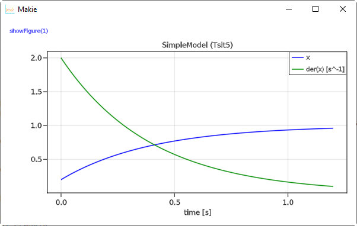
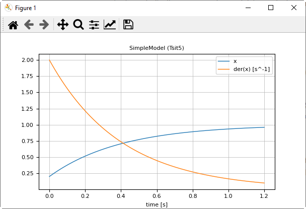

# 1 Getting Started
    
A simple differential equation with $x(t) \in \R$

```math
T \cdot \frac{dx}{dt} + x = 1; \;\;\; x(t_0) = 0.2
```

can be defined, simulated and plotted with the following commands:

```julia
using TinyModia
using DifferentialEquations
using Unitful
@usingModiaPlot   # Use plot package defined with ENV["MODIA_PLOT"] or usePlotPackage(..)


# Define model
SimpleModel = Model(
    T = 0.4,
    x = Var(init=0.2),
    equation = :[T * der(x) + x = 1],
)

# Transform to ODE form
simpleModel = @instantiateModel(SimpleModel)

# Simulate with a default integrator of DifferentialEquations
simulate!(simpleModel, stopTime = 1.2)

# Simulate with a specific integrator (Tsit5) and use a unit for stopTime
simulate!(simpleModel, Tsit5(), stopTime = 1.2u"s")

# Produce a line plot
plot(simpleModel, ("x", "der(x)"))
```

A model is defined with a constructor `Model` taking a comma separated list of name/value pairs.
The model consist of a definition of a parameter `T` with default value 0.2.
Constructor `Var` with an `init` key is used to define the initial condition 0.2 of the state `x`, and one equation. Equations can have a Julia expression on both sides of the equal sign and are given as a *quoted* array expression `:[ ]` assigned to a unique identifier such as `equation`.

Macro `@instantiateModel(..)`  symbolically processes the model, in particular solves the equation
for the derivative `der(x)`, so the following equation will be used by the integrator:

```math
\frac{dx}{dt} = (1 - x) / T
```

Furthermore, a Julia function is generated and compiled to evaluate this equation. `@instantiateModel(..)`
returns an instance containing all the information needed for the further steps.

The first [`simulate!`](@ref) function performs one simulation with an integrator of package
[DifferentialEquations.jl](https://github.com/SciML/DifferentialEquations.jl), that this package
automatically selects. The second `simulate!` call defines the integrator as second argument.
Integrator `Tsit5` is an [adaptive Runge-Kutta method of order 5/4 from Tsitouras](https://www.sciencedirect.com/science/article/pii/S0898122111004706). There are > 100 ODE integrators provided. For details, see [here](https://docs.sciml.ai/stable/solvers/ode_solve/). The simulation result is stored inside `simpleModel`.

Function call `plot(..)` produces a line plot. Variables to be plotted
are defined as tuples or arrays of variable names. Tuples are displayed in one diagram. A Vector or
matrix of tuples or strings are displayed as vector or matrix of diagrams. 
Command `plot(..)` produces the following image 



when `ENV["MODIA_PLOT"] = "GLMakie"` is set, and the image



when `ENV["MODIA_PLOT"] = "PyPlot"` is set. In the latter case the tool bar
of PyPlot provides various interactive commands, for example to zoom into the 
plot or to store the plot in different formats on file.
